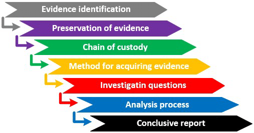

# 🔍 Forensic Methodologies  
  
 

---

## 👨‍💻 About the Developer  

Hi, I'm **Abimael Pérez Vega**, a passionate **cybersecurity** and **software development** engineer. I love uncovering vulnerabilities, ethical hacking, and building secure systems. My journey in cybersecurity began with a deep curiosity about how systems work and how they can be protected from threats.  

📌 **Connect with me:**  
- 🔗 [LinkedIn](https://www.linkedin.com/in/abimael-perez-vega-8870b6320/)   

---

## 📜 Project Overview  

**"Forensic Methodologies"** is a hands-on digital forensics project where we analyze **metadata, extract hidden information, and investigate security vulnerabilities** using forensic tools.  

This repository is structured to help learners **develop key forensic analysis skills** by working with **real-world scenarios** involving image metadata, GPS tracking, and vulnerability detection.  

### **📂 Repository Structure**  

holbertonschool-0x02_forensic_methodologies/ └── cybersecurity_basics/ ├── 0-mystery.txt ├── 1-location.txt ├── 2-intruder_intent.txt ├── 3-vulnerability_type.txt ├── 4-attack_method.txt ├── 5-ripple_effect.txt ├── README.md

---

## 🕵️‍♂️ Case Studies  

### 🔍 **0. The Case of the Mysterious Image**  

**Objective:**  
- Use forensic analysis tools to uncover metadata and extract hidden information.  

**Steps:**  
1. Analyze image metadata using `exiftool`.  
2. Identify suspicious metadata entries that may contain the **owner's name**.  
3. Save the extracted name into `0-mystery.txt`.  

💾 **Example Submission:**  
```sh
$ cat 0-mystery.txt
John_Doe
🌍 1. Unraveling Location Clues from Image Metadata
Objective:

Extract GPS coordinates from image metadata and pinpoint the real-world location.
Steps:

Use exiftool to extract GPS coordinates from the image.
Enter the coordinates into Google Maps to locate the area.
Identify the street name and save it into 1-location.txt.

---

$ cat 1-location.txt
123 Example St, Forensics City
🚀 Features Implemented
✅ Metadata extraction using forensic tools.
✅ GPS coordinate tracking to pinpoint locations.
✅ Hands-on investigation tasks for cybersecurity training.

🔮 Future Enhancements
📌 Add more case studies with real-world forensic scenarios.
📌 Implement automated forensic scripts for metadata extraction.
📌 Develop an interactive web-based forensic analysis tool.

💡 Challenges Faced
🔸 Deciphering hidden metadata – Some files had deeply embedded information.
🔸 GPS tracking accuracy – Finding precise locations required external verification.
🔸 Handling different image formats – Some formats required extra tools to extract data.

🔗 Clone the Repository
git clone https://git@github.com:AbimaelPerezVega/holbertonschool-0x02_forensic_methodologies.git
